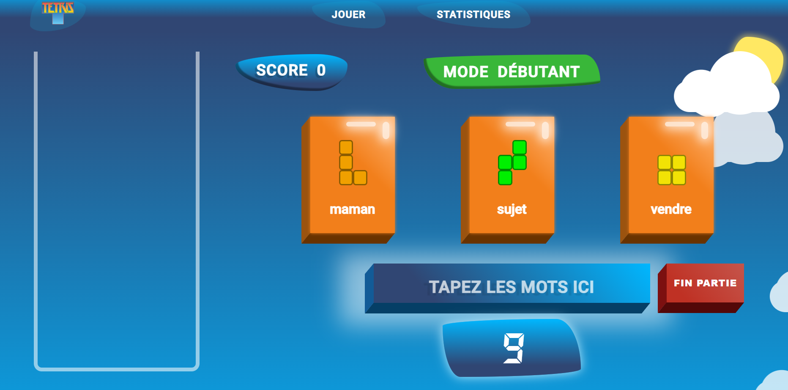
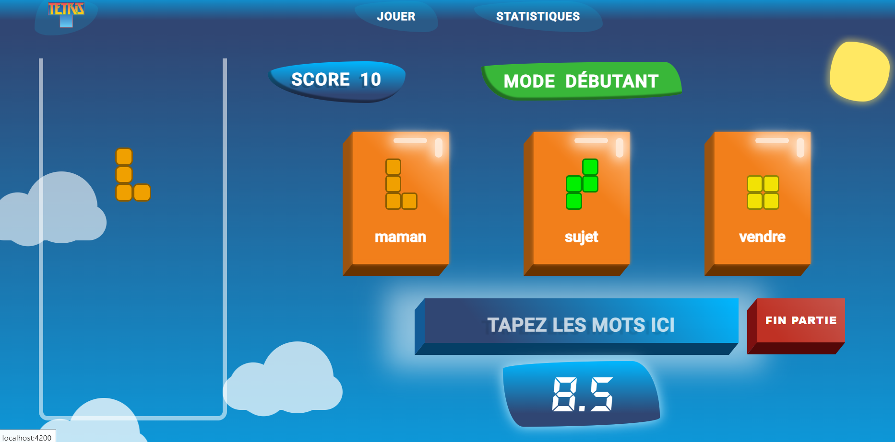
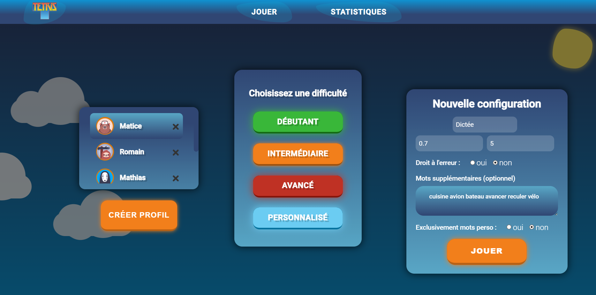
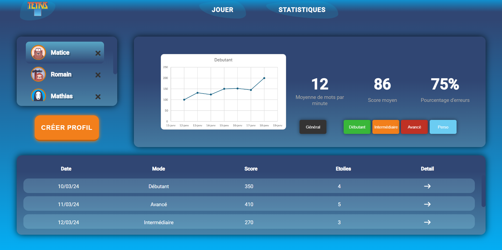
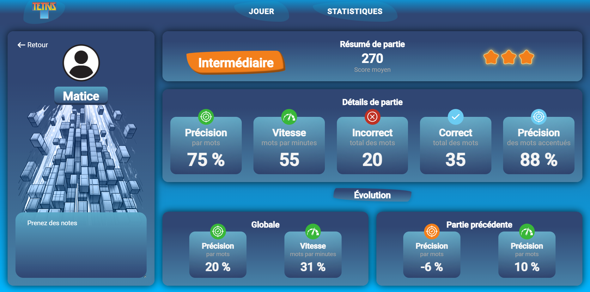

# Projet Tetris pour Jeunes Atteints de Troubles Dys

<div align="center">
    
</div>

## Table des Matières

- [Description](#description)
- [Fonctionnalités](#fonctionnalités)
  - [Jeu de Tetris Adapté](#1-jeu-de-tetris-adapté)
  - [Partie Statistiques](#2-partie-statistiques)
  - [Configurations Personnalisées](#3-configurations-personnalisées)
- [Installation](#installation)
  - [Prérequis](#prérequis)
  - [Étapes](#étapes)
- [Utilisation](#utilisation)
  - [Lancer une Partie](#lancer-une-partie)
  - [Exemple](#exemple)
  - [Commandes](#commandes)
  - [Configuration du Jeu](#configuration-du-jeu)
  - [Consulter les Statistiques](#consulter-les-statistiques)

## Description

Ce projet Tetris est conçu pour aider les jeunes atteints de troubles dys (dyslexie, dysorthographie, etc.) dans leur apprentissage. Il fournit également aux ergothérapeutes des outils pour suivre les progrès de leurs patients. Le jeu combine les éléments traditionnels de Tetris avec des exercices de reconnaissance de mots, rendant l'apprentissage à la fois ludique et pédagogique.

---

## Fonctionnalités

### 1. Jeu de Tetris Adapté

- **Trois mots affichés** : Trois mots sont affichés à l'écran. L'utilisateur doit taper l'un des mots pour choisir le bloc Tetris associé.
- **Jeu Tetris** : Une fois le mot choisi, le bloc correspondant est placé sur le plateau de jeu.
- **Zone de texte** : Une zone de texte permet aux utilisateurs de saisir les mots affichés.


### 2. Partie Statistiques

- **Suivi des progrès** : Permet aux ergothérapeutes de suivre les progrès des jeunes en visualisant les statistiques.
- **Détails des sessions** : Visualisation des statistiques globales et des détails pour chaque session de jeu.


### 3. Configurations Personnalisées

- **Configurations du jeu** : Possibilité de créer des configurations personnalisées pour adapter le jeu aux besoins spécifiques des utilisateurs.
- **Mots personnalisés** : Ajout de listes de mots personnalisés pour des dictées ou exercices spécifiques.
- **Temps adaptif** : Le timer pour écrire les mots est proportionnel au nombre de caractères du mot le plus long, ce qui ajuste la difficulté en fonction des mots à taper.

---

## Installation

### Prérequis

- [Docker](https://www.docker.com/)
- [Shell Bash](https://www.gnu.org/software/bash/)

### Étapes

1. Clonez le dépôt :
    ```bash
    git clone https://github.com/2019-2020-ps6/2023-2024-ps6-tetrys/
    ```
2. Accédez au répertoire `/ops` :
    ```bash
    cd 2023-2024-ps6-tetrys/ops/
    ```
3. Lancez le script `run.sh` :
    ```bash
    docker-compose up
    ```
5. Ouvrez votre navigateur à `http://localhost:4200`.

---

## Utilisation

### Lancer une Partie

1. **Sélectionnez un mot** : Choisissez un des trois mots affichés en le tapant dans la zone de texte.
2. **Jeu de Tetris** : Le bloc associé au mot choisi apparaîtra sur le plateau de jeu. Jouez à Tetris comme d'habitude pour positionner les blocs.
3. **Statistiques** : À la fin de chaque partie, vous pouvez consulter les statistiques pour voir vos performances.

### Exemple 

<div align="center">
    <h3>Affichage d'une partie dans le mode débutant</h3>
    
</div>

---

<div align="center">
    <h3>Après avoir correctement écrit le mot "maman"</h3>
    
</div> 

On peut donc placer le block associé dans la grille de jeu Tetris comme on a l'habitude de le faire. Pour plus de détails sur la manipulation des blocs, voir [Commandes](#commandes).

---

### Commandes

Le jeu Tetris utilise les touches fléchées pour contrôler les blocs. Voici les commandes :

- **Flèche de gauche `←`** : Déplace le bloc vers la gauche.

- **Flèche de droite `→`** : Déplace le bloc vers la droite.

- **Flèche du bas `↓`** : Accélère la descente du bloc.

- **Flèche du haut `↑`** : Fait pivoter le bloc.


### Configuration du Jeu

1. **Accéder aux configurations** : Allez dans le menu des configurations.
2. **Créer une nouvelle configuration** : Ajoutez une nouvelle configuration en définissant les paramètres souhaités.
3. **Ajouter des mots personnalisés** : Ajoutez des mots personnalisés à utiliser pendant le jeu ou les dictées.

---

<div align="center">
    <h3>Exemple de création de config perso pour une dictée</h3>
    
</div>

---

### Consulter les Statistiques

1. **Accéder aux statistiques** : Allez dans le menu des statistiques pour voir les résultats globaux et les détails des sessions.
2. **Analyser les progrès** : Utilisez les statistiques pour analyser les progrès des utilisateurs au fil du temps. La partie **statistiques detaillées** est accessbile en cliquant la flèche de détail dans l'historique des parties. Un code couleur permet de visualiser très rapidement si l'utilisateur rencontre des difficultées. En plus de l'affichage de l'évolution globale et par rapport à la partie précédente de l'utilisateur pendant cette partie.
   
---

<div align="center">
    <h3>Statistiques générales d'un utilisateur par mode et historique de ses parties</h3>
    
</div>

---

<div align="center">
    <h3>Statistiques détaillées pour la partie d'un utilisateur avec code couleur</h3>
    
</div>

