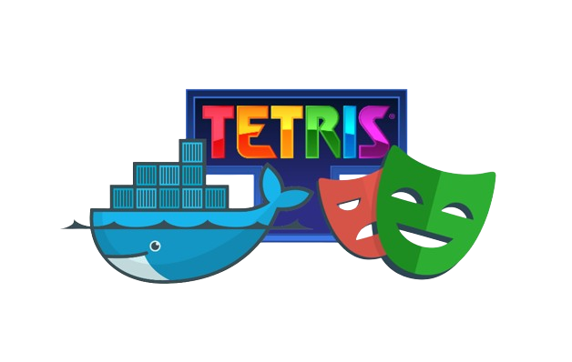

# Stratégie de Test

    

## Table des Matières

1. [Introduction](#introduction)
2. [Critères de Priorisation des Tests](#critères-de-priorisation-des-tests)
3. [Scénarios de Test](#scénarios-de-test)
   - [Scénario 1](#scénario-1)
   - [Scénario 2](#scénario-2)
   - [Scénario 3](#scénario-3)
4. [Justifications et Explications](#justifications-et-explications)
   - [Justification des Tests](#justification-des-tests)
   - [Explication des Tests](#explication-des-tests)
5. [Ops](#ops)
6. [Annexes](#annexes)

---

## Introduction

Ce document présente la stratégie de test pour l'application de gestion de jeux éducatifs pour des utilisateurs ayant des troubles d'apprentissage. Les tests visent à vérifier le bon fonctionnement des fonctionnalités clés en fonction des scénarios définis.

## Critères de Priorisation des Tests

Nous avons défini les critères suivants pour prioriser nos tests :

1. **Jouer au jeu** : Fonctionnalité critique pour l'expérience utilisateur.
2. **Sélectionner/créer une difficulté, prédéfinie ou personnalisée, pour jouer** : Important pour adapter l'expérience de jeu.
3. **Pouvoir sélectionner un (nouvel) utilisateur (créer/supprimer)** : Nécessaire pour la gestion des utilisateurs.
4. **Accéder aux statistiques** : Secondaire pour le suivi de la progression des utilisateurs.

---

## Scénarios de Test

### Scénario 1

- **Situation** : L’ergothérapeute crée un compte pour son nouveau jeune, Thomas qui est dysorthographique, puis lance une partie en mode débutant pour présenter l’appli à Thomas.
- **Consignes** :
  1. Créer un compte pour le nouvel étudiant.
  2. Lancer une partie avec ce nouveau compte en mode débutant.
  3. Jouer la partie.
  4. Aller voir les statistiques globales de la partie.

### Scénario 2

- **Situation** : Lucas, dyslexique, a une dictée prévue la semaine prochaine. Pour s'entraîner, l’ergothérapeute crée une partie avec une config personnalisée avec des caractéristiques proches du mode intermédiaire mais avec une liste de mots personnalisée en plus.
- **Consignes** :
  1. Créer/sélectionner le profil de Lucas.
  2. Lire les caractéristiques du mode intermédiaire.
  3. Créer une config perso avec les mêmes caractéristiques que le mode intermédiaire.
  4. Ajouter une liste de mots.
  5. Lancer la partie et vérifier la présence des mots ajoutés.

### Scénario 3

- **Situation** : L’ergothérapeute a besoin d’évaluer la progression de Lucas pour valider sa montée au niveau de jeu supérieur. Pour cela, elle peut aller consulter ses statistiques globales, ses stats globales concernant le mode intermédiaire et aussi aller voir les détails de quelques parties en mode intermédiaire. Si les signes sont au vert, la montée est validée, sinon non.
- **Consignes** :
  1. Aller dans l’onglet Statistiques.
  2. Voir les stats globales de Lucas.
  3. Voir les stats du mode intermédiaire.

---

## Justifications et Explications

### Justification des Tests

1. **Jouer au jeu**
   - **Critique** : Assure le fonctionnement de la fonctionnalité principale. Un jeu non fonctionnel compromet toute l'application.
   - **Scénario 1** : Test de base de l'interaction utilisateur avec le jeu.
   - **Scénario 2** : Vérification de la configuration personnalisée.

2. **Sélectionner/créer une difficulté**
   - **Important** : La personnalisation des niveaux de difficulté est essentielle pour adapter le jeu aux besoins spécifiques de chaque utilisateur.
   - **Scénario 1** : Vérification de la sélection d'un niveau standard.
   - **Scénario 2** : Création et utilisation d'une configuration personnalisée.

3. **Gestion des utilisateurs**
   - **Nécessaire** : La capacité de gérer des utilisateurs est fondamentale pour la personnalisation de l'expérience de chaque utilisateur.
   - **Scénario 1** : Création d'un compte pour un nouvel utilisateur.
   - **Scénario 3** : Sélection et gestion d'un profil existant.

4. **Accéder aux statistiques**
   - **Secondaire** : Bien que moins critique, l'accès aux statistiques est important pour évaluer la progression et adapter les stratégies éducatives.
   - **Scénario 3** : Vérification de la fonctionnalité de statistiques pour un utilisateur existant.

### Explication des Tests

1. **Scénario 1**
   - **Objectif** : Valider le processus complet de création de compte et d'interaction initiale avec le jeu.
   - **Étapes** : De la création du compte à la visualisation des premières statistiques.
   - **Attendu** : Confirmation que les fonctionnalités de base sont opérationnelles.

2. **Scénario 2**
   - **Objectif** : Tester la personnalisation des paramètres de jeu pour s'assurer de leur flexibilité.
   - **Étapes** : Création d'une configuration personnalisée en ajoutant une liste de mots spécifique.
   - **Attendu** : Vérification que les configurations personnalisées sont respectées dans le jeu.

3. **Scénario 3**
   - **Objectif** : Évaluer la précision et l'utilité des statistiques pour suivre la progression de l'utilisateur.
   - **Étapes** : Consultation des statistiques globales et spécifiques.
   - **Attendu** : Assurance que les données de progression sont correctement collectées et affichées.

---

## Ops

### Étape 1 : dockeriser le front et le back
1. **Back** : On utilise bien une image node (alpine pour prendre moins d'espace), on copie les fichiers déclarant les dépendances, on les installe puis on copie notre base de données. Après on expose le port 9428
2. **Front** : On vient prendre une image node afin de construire la première image. Celle-ci va lancer le build du html avec comme adresse de back différente de celle du lancement local: http://localhost:8081/api. Cela construit le dossier dist qui contient le html compilé. On utilise ensuite une image nginx qui sert de serveur, on y copie le html compilé et de quoi résoudre la resolution de chemins. On expose enfin le port 80

Après le back, pour les run, on `docker run -p 8081:9428 back:latest` puis `docker run -p 8080:80 back:latest`

On peut ensuite visiter http://localhost:8080 et s'amuser comme des fous sur ce site incroyable

### Étape 2 : docker compose 
On crée 2 services, un pour le front, un pour le back. 
1. **Back** : On cible le dossier backend depuis le docker compose, on met aussi en place un volume qui va servir à sauvegarder les données du backend entre les restarts. On met aussi en place un health-check, celui-ci va permettre de vérifier l'état du conteneur en envoyant une requête executée regulièrement via wget, (pas curl car celui n'est pas disponible sur node-alpine). On lance toujours sur les ports 8081:9428. 
2. **Front** : Pour build le service front, on s'assure d'avoir l'argument ENVIRONNEMENT=docker, afin de garder la bonne adresse pour le back. On ajoute aussi la propriété depends_on: backend, condition: service_healthy. Celle-ci va permettre d'executer le health-check du backend afin de vérifier son état. Si et seulement si le backend est stable et renvoi une réponse, alors à ce moment là on pourra lancer le service frontend.

Pour lancer les services, `docker compose up --build` ou `sh run.sh`

### Étape 3 : docker compose, partie test

1. **Playwright** :  Pour dockeriser toute l'éxecution des tests, on a besoin d'un container pour les runs et les sauvegardes vidéos/screens. On utilise l'image vérifiée par microsoft pour playwright, on a besoin de copier le dossier frontend afin que playwright ait accès aux fixtures du projet. On lance ensuite la commande qui run les tests.
2. **Docker compose** : On commence par attribuer un volume au container pour qu'il enregistre les résultats des tests, on ajoute ensuite sa dépendance envers frontend via un 'depends_on: frontend' qui appelle un health-check sur le container frontend. Pour les health-check, et pour l'url du back on utilise la propriété network du docker compose, celui-ci permet de s'adresser directement à un conteneur voisin via une url de type http://nomDuContainer:port. On compile en effet le frontend avec l'argument ENVIRONNEMENT=e2e, qui permet de build avec l'url de back: http://backend-e2e:9428/api. La resolution de l'adresse est faite par le network.

## Annexes

- [Vidéo](#)
- [ReadMe](#)

